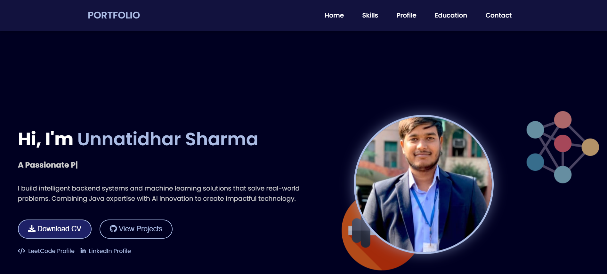

# 💼 Personal Portfolio Website

Welcome to my **personal portfolio website** built using **HTML**, **CSS**, and **JavaScript**. This project is designed to showcase my **skills**, **projects**, **resume**, and **contact details** in a modern and responsive layout.

---

## 🔗 Live Demo

➡️ [Click here to view the live site](https://unnatidharsharma.github.io/Portfolio/)  

---

## 🖼️ Preview

  

---

## 📂 Project Structure

```
portfolio/
├── index.html # Main HTML file
├── style.css # CSS styling
├── script.js # JavaScript for interactivity
├── assets/
│ ├── images/ # All images/icons used
│ └── resume.pdf # Your resume file
└── README.md # This README file
```


---

## ✨ Features

- ✅ Responsive Design – Mobile, Tablet & Desktop
- ✅ Clean, Modern UI/UX
- ✅ Smooth Scrolling Navigation
- ✅ Animated Project Cards
- ✅ Skills Section with Icons
- ✅ Resume Download Option
- ✅ Contact Form (Static/Backend-ready)
- ✅ Scroll Reveal & Button Effects

---

## 🛠️ Tech Stack

| Technology | Description |
|------------|-------------|
| HTML5      | Structure & content |
| CSS3       | Styling, Flexbox, Grid, Animations |
| JavaScript | DOM manipulation & interactivity |
| Font Awesome | Icons |
| Google Fonts | Custom fonts |

---

## 🚀 Getting Started

To run this website locally:

```bash
# Clone the repository
git clone https://github.com/Unnatidharsharma/Portfolio.git

# Navigate to the folder
cd portfolio

# Open in browser
Open index.html with any browser


```


📬 Contact Me
Want to collaborate or connect?

📧 Email: your.email@example.com

💼 LinkedIn: linkedin.com/in/yourprofile

💻 GitHub: github.com/your-username

📜 License
This project is licensed under the MIT License – you're free to use, modify, and distribute it.
```
